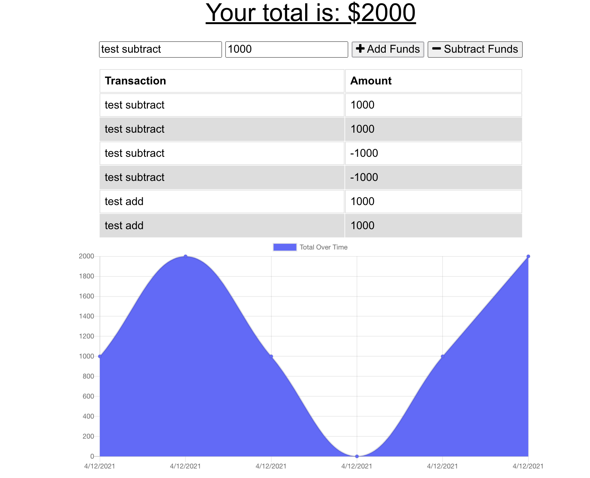

# moremoneymoreproblems

## Table of Contents

* [Introduction](#Introduction)
* [Installation](#Installation)
* [Libraries and Technologies Used](#Libraries)
* [Usage](#Usage)
* [License](#License)
* [Screenshot](#Screenshot)
* [Link](#Link)

## Introduction

## Installation

## Technologies used 

## Usage

## License

## Screenshot
# Application launched in atlas 

# Atlas Dashboard 

# Application with information saved 

# Link

 ## link to heroku launched application
 
* Link: https://momoneymoproblems.herokuapp.com/

## link to GitHub 
