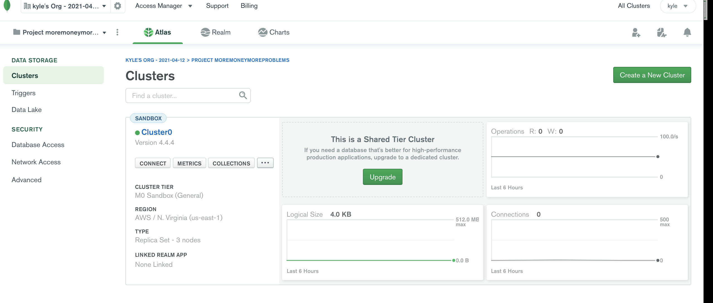

# moremoneymoreproblems

## Table of Contents

* [Introduction](#Introduction)
* [Libraries and Technologies Used](#Libraries)
* [Usage](#Usage)
* [License](#License)
* [Screenshot](#Screenshot)
* [Link](#Link)

## Introduction

As a wealth focued individual I want to be able to track my withdrawals and deposits with or without a data/internet connection so that my account balance is accurate whenever I check.

## Technologies used 
VS code, node, express, morgan,  mongodb

## Usage

Click on this link to use Application https://momoneymoproblems.herokuapp.com/

## License

## Screenshot
# Application launched in atlas 

# Atlas Dashboard 

# Application with information saved 

# Link

 ## link to heroku launched application
 
* Link: https://momoneymoproblems.herokuapp.com/

## link to GitHub 

* Link: https://github.com/spental/moremoneymoreproblems
